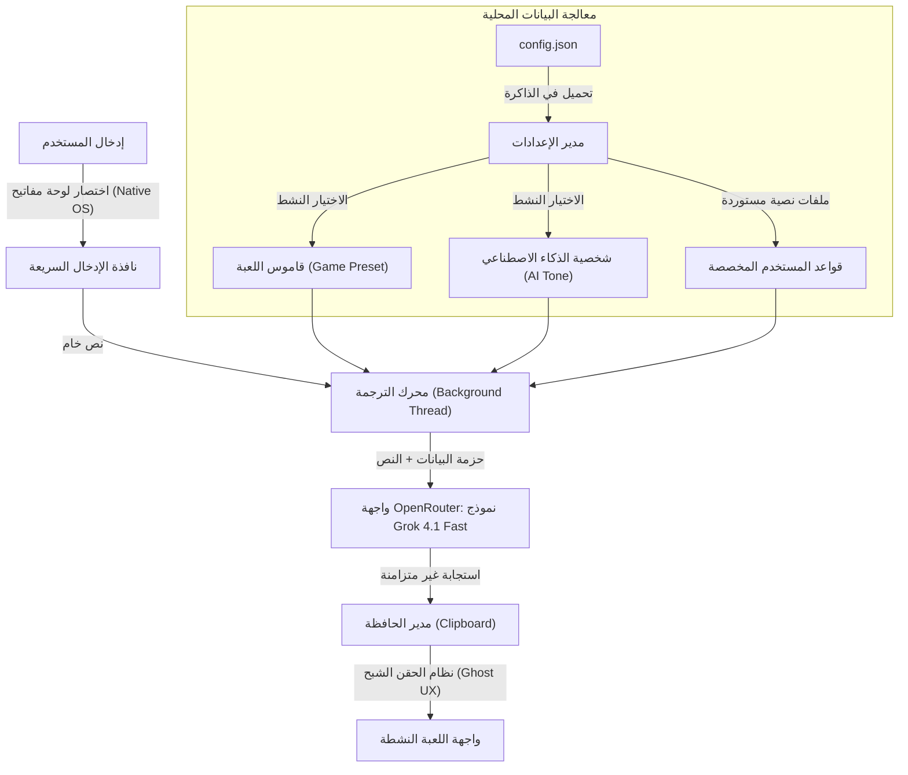

# جسر الترجمة (Translation Bridge)

جسر الترجمة هو تطبيق مخصص لنظام ويندوز صُمم خصيصاً لمجتمعات اللاعبين (Gamers) والبيئات التنافسية. يقوم البرنامج بترجمة المدخلات العربية (وبالتحديد العامية السعودية/الخليجية) إلى إنجليزية أمريكية طليقة تعتمد على مصطلحات الألعاب، وذلك بشكل فوري وفي الخلفية دون مقاطعة اللعب.

## هيكلية التطبيق وتدفق البيانات

يتعامل التطبيق مع البيانات الداخلية عبر مسار حقن صارم لضمان أقصى درجات الدقة في السياق، مع انعدام كامل لزمن التأخير (اللاق).



## واجهة المستخدم وفلسفة التصميم

تم بناء واجهة المستخدم الرسومية باستخدام مكتبة `customtkinter`، وصُممت بدقة لتعكس طابعاً احترافياً يعتمد على الوضع الليلي السلس (مستوحى من واجهات Aston Martin). يعتمد التصميم على درجات اللون الأخضر الداكن والرمادي العميق لتقليل إجهاد العين أثناء جلسات اللعب الطويلة.

- **التشغيل الهادئ:** يعمل التطبيق بصمت من خلال شريط مهام ويندوز (System Tray) لضمان عدم ازدحام الشاشة.
- **تراكب سلس:** تقوم نافذة الترجمة السريعة بتجاوز الطبقات (Z-indexing) لتبقى مرئية بشكل كامل فوق أي نافذة لعبة (Borderless) دون أن تسرق أولوية عرض الرسومات من اللعبة.

## الميزات الهندسية الأساسية

- **اختصارات أصلية بلا تأخير (Zero-Lag Hotkeys):** تتجاوز الاختصارات مكتبات بايثون العامة، وبدلاً من ذلك ترتبط مباشرة بحلقة رسائل نظام ويندوز (Message Loop عبر `user32 RegisterHotKey`). بفضل هذا التصميم، يستهلك البرنامج 0% من قدرة المعالج ولا يسبب أي انخفاض في الإطارات (FPS Drops) أثناء المباريات التنافسية.
- **وضع الإخفاء الشبح (Ghost UX):** عند استخدام نظام (النسخ) التنافسي، تقوم واجهة الإدخال بتدمير نفسها فور إرسال الطلب، مما يتيح للاعب استعادة التحكم الكامل باللعبة في أجزاء من الثانية، بينما تتم معالجة الترجمة في خيط (Thread) منفصل في الخلفية.
- **التشكيل الديناميكي للبيانات (Modular Profiling):** بدلاً من الاعتماد على قواميس ثابتة، يقوم النظام ببناء منطقه ديناميكياً. يمكن للمستخدمين استيراد ملفات نصية (مشاركة من المجتمع) لتدريب البرنامج كقواعد صارمة يتجاهل الذكاء الاصطناعي من أجلها أي تعليمات افتراضية أخرى.

## التثبيت والتشغيل

### المتطلبات الأساسية
يتطلب وجود بيئة (Python 3.10) أو أحدث.

```cmd
pip install -r requirements.txt
python chat_bridge.py
```

### بناء النسخة النهائية
لتحويل التطبيق إلى ملف تنفيذي مستقل `.exe` لا يحتاج إلى تثبيت بايثون:
```cmd
.\build.bat
```
سيتم إنشاء الملف النهائي داخل مجلد `dist/`.

## الخصوصية والأمان
تُعالج وتحفظ جميع مفاتيح الـ (API)، وملفات القواميس المستوردة، وقواعد البيانات محلياً كملفات (JSON) داخل مسار التطبيق. تم تعطيل عمليات التتبع بالكامل، وتُرسل سلاسل النصوص المراد ترجمتها مباشرة من الذاكرة العشوائية إلى خوادم الـ API دون تسجيلها في أي وسيط.
