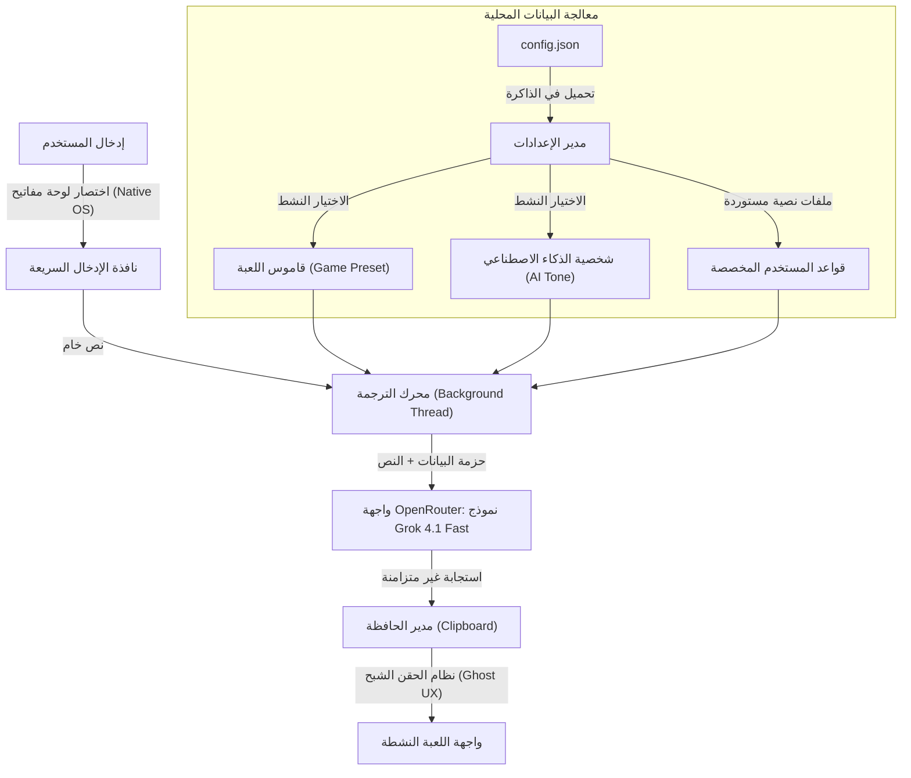

# جسر الترجمة (Translation Bridge)

جسر الترجمة هو تطبيق مخصص لنظام ويندوز صُمم خصيصاً لمجتمعات اللاعبين (Gamers) والبيئات التنافسية. يدعم أكثر من 14 لغة مع إمكانية الترجمة من أي لغة إلى أي لغة أخرى. يتميز بذكاء اصطناعي يفهم العامية والسياق ويترجم بأسلوب يناسب ثقافة الألعاب، وذلك بشكل فوري وفي الخلفية دون مقاطعة اللعب.

## هيكلية التطبيق وتدفق البيانات

يتعامل التطبيق مع البيانات الداخلية عبر مسار حقن صارم لضمان أقصى درجات الدقة في السياق، مع انعدام كامل لزمن التأخير (اللاق).



## بنية المشروع

```
CHAT helper/
├── chat_bridge.py              # نقطة الدخول (Wrapper)
├── chat_bridge/                # الحزمة الرئيسية
│   ├── __main__.py             # نقطة الدخول + Logging + Single Instance
│   ├── app.py                  # التطبيق الرئيسي (UI + Logic)
│   ├── translator.py           # محرك الترجمة (OpenRouter API)
│   ├── config.py               # إدارة الإعدادات + المفاتيح + التاريخ
│   ├── hotkey.py               # نظام الاختصارات الأصلي (Win32 API)
│   ├── tray.py                 # System Tray
│   ├── constants.py            # الثوابت والـ Prompts والـ Presets
│   └── ui/
│       ├── theme.py            # ألوان التصميم
│       ├── setup_screen.py     # شاشة الإعداد الأولي
│       ├── main_screen.py      # واجهة الشاشة الرئيسية
│       ├── settings.py         # نافذة الإعدادات
│       ├── toast.py            # إشعارات Toast
│       └── history.py          # سجل الترجمات
├── assets/                     # الأصول (logo, icon)
├── website/                    # صفحة الموقع (Landing Page)
├── requirements.txt
├── build.bat                   # بناء ملف EXE
└── README.md
```

## الميزات الهندسية الأساسية

- **دعم متعدد اللغات (14+ لغة):** يدعم الترجمة من أي لغة إلى أي لغة أخرى — عربي، إنجليزي، تركي، كوري، روسي، ياباني، فرنسي، ألماني وغيرها. مع خيارات مستقلة للغة المصدر ولغة الهدف.
- **اختصارات أصلية بلا تأخير (Zero-Lag Hotkeys):** ترتبط مباشرة بحلقة رسائل نظام ويندوز (Message Loop عبر `user32 RegisterHotKey`). يستهلك البرنامج 0% من قدرة المعالج ولا يسبب أي انخفاض في الإطارات أثناء المباريات التنافسية.
- **وعي بالسياق والجنس (Context & Gender Awareness):** يكشف الذكاء الاصطناعي الجنس من تصريف الفعل العربي ويترجم بشكل مناسب — يفرّق بين مخاطبة الذكر والأنثى.
- **وضع الإخفاء الشبح (Ghost UX):** تقوم واجهة الإدخال بتدمير نفسها فور إرسال الطلب، مما يتيح للاعب استعادة التحكم الكامل باللعبة في أجزاء من الثانية.
- **التشكيل الديناميكي للبيانات (Modular Profiling):** يمكن للمستخدمين استيراد ملفات نصية لتدريب البرنامج كقواعد صارمة.
- **سجل الترجمات (Translation History):** يحفظ آخر 50 ترجمة مع إمكانية النسخ بضغطة واحدة.
- **إشعارات فورية (Toast Notifications):** إشعارات متحركة عند نجاح أو فشل الترجمة.
- **نظام تسجيل ذكي (Logging):** يسجل جميع العمليات في ملف log داخل APPDATA لتسهيل تشخيص المشاكل.

## التثبيت والتشغيل

### المتطلبات الأساسية
يتطلب وجود بيئة (Python 3.10) أو أحدث.

```cmd
pip install -r requirements.txt
python chat_bridge.py
```

### بناء النسخة النهائية
لتحويل التطبيق إلى ملف تنفيذي مستقل `.exe` لا يحتاج إلى تثبيت بايثون:
```cmd
.\build.bat
```
سيتم إنشاء الملف النهائي داخل مجلد `dist/`.

## الخصوصية والأمان
تُعالج وتحفظ جميع مفاتيح الـ (API)، وملفات القواميس المستوردة، وقواعد البيانات محلياً كملفات (JSON) داخل مسار التطبيق. تم تعطيل عمليات التتبع بالكامل، وتُرسل سلاسل النصوص المراد ترجمتها مباشرة من الذاكرة العشوائية إلى خوادم الـ API دون تسجيلها في أي وسيط.
