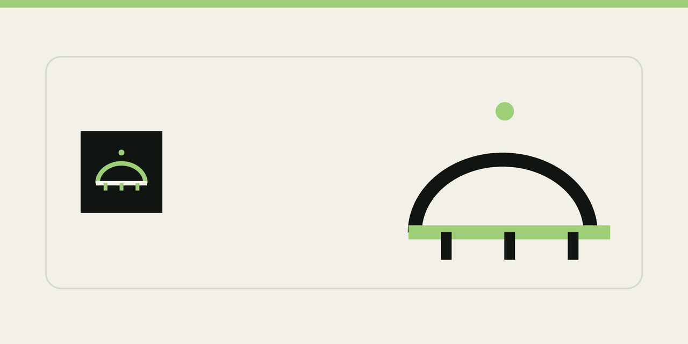
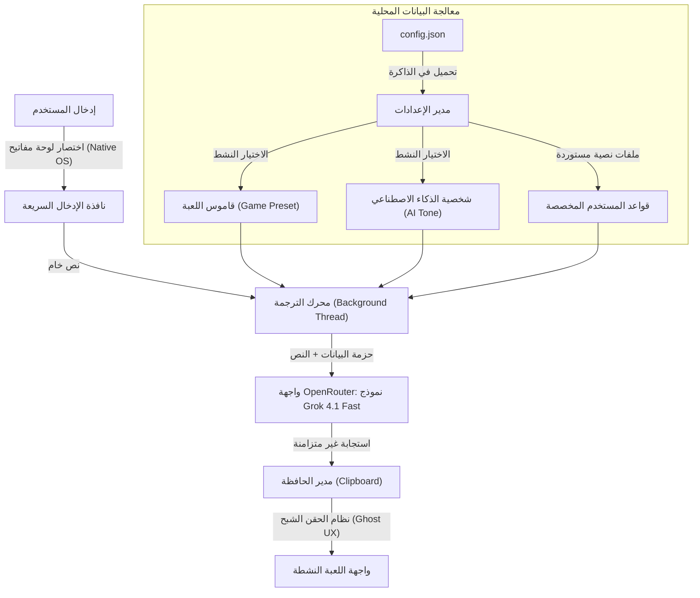

<div align="center">



<br><br>

# ⚡ Translation Bridge — جسر الترجمة

### ترجم بسرعة البرق وأنت تلعب

<br>

[](https://github.com/kenshln47/TRANSLATION-BRIDGE/releases)
[](LICENSE)
[](https://python.org)
[](https://github.com/kenshln47/TRANSLATION-BRIDGE/releases)

<br>

[](https://github.com/kenshln47/TRANSLATION-BRIDGE/stargazers)
[](https://github.com/kenshln47/TRANSLATION-BRIDGE/network/members)
[](https://github.com/kenshln47/TRANSLATION-BRIDGE/issues)
[](https://github.com/kenshln47/TRANSLATION-BRIDGE/commits/main)

<br>

**اكتب بلغتك → يوصل بأي لغة ثانية. بدون لاق، بدون تعقيد.**

🇸🇦 🇬🇧 🇹🇷 🇪🇸 🇫🇷 🇧🇷 🇷🇺 🇩🇪 🇰🇷 🇯🇵 🇮🇳 🇨🇳 +المزيد

<br>

[📥 تحميل مجاني](https://github.com/kenshln47/TRANSLATION-BRIDGE/releases) · [🌐 الموقع](https://kenshln47.github.io/TRANSLATION-BRIDGE/) · [🐛 بلّغ عن مشكلة](https://github.com/kenshln47/TRANSLATION-BRIDGE/issues)

</div>

<br>

---

<br>

## 🎯 الفكرة

تطبيق ويندوز يترجم لك وأنت تلعب. تضغط اختصار، تكتب بلغتك، يرسل بلغة الشخص الثاني. يدعم **14+ لغة** ويفهم العامية والسلانق. مو ترجمة قوقل حرفية.

<br>

## ✨ المميزات

<table>
<tr>
<td width="50%">

### ⚡ Zero-Lag Hotkeys
اختصارات مربوطة مباشرة بـ Windows API. **0% CPU** وبدون أي drop بالفريمات

### 🌍 14+ لغة
اختار أي لغة مصدر وأي لغة هدف. عربي، إنجليزي، تركي، كوري، ياباني وغيرها

### 🧠 AI يفهم السياق
يستخدم **Grok 4.1 Fast**. يفهم العامية والجنس من تصريف الفعل

</td>
<td width="50%">

### 🎮 Game Presets
قواميس جاهزة لـ GTA RP، Valorant، FIFA، LoL، Fortnite وغيرها

### 👻 Ghost UX
نافذة الإدخال تدمر نفسها فوراً. ترجع للعبة بأجزاء من الثانية

### 🤬 4 أنماط ترجمة
Gamer عادي • Chill مريح • Formal رسمي • Rage Mode 🔥

</td>
</tr>
</table>

<br>

## 🔧 كيف يشتغل؟

```
   ┌─────────────────┐     ┌──────────────────┐     ┌─────────────────┐
   │  1️⃣  اضغط        │────▶│  2️⃣  اكتب بلغتك   │────▶│  3️⃣  Enter وخلاص │
   │  Ctrl+Shift+T   │     │  بالنافذة الشفافة │     │  يرسل بالشات    │
   └─────────────────┘     └──────────────────┘     └─────────────────┘
```

<br>

## 📊 هيكلية التطبيق



<br>

## 🎮 الألعاب المدعومة

<div align="center">

| اللعبة | المصطلحات المتخصصة |
|:------:|:------------------:|
| 🚗 **GTA V RP** | VDM, RDM, NVL, OOC, كود 10 |
| 🔫 **Valorant / CS2** | Peek, Rotate, Eco, Flash, Clutch |
| ⚽ **EA FC (FIFA)** | Through ball, Finesse, SBC, TOTS |
| 🧙 **LoL / Dota 2** | Gank, Dive, Feed, Baron, FF |
| 🦸 **Overwatch / Apex** | Ult, Crack, Knock, Third-party |
| 🏗️ **Fortnite** | Box, Crank, Edit, Storm, Rotate |
| ⛏️ **Minecraft / Roblox** | Grief, Raid, Enchant, Obby |

</div>

<br>

## 📁 بنية المشروع

```
TRANSLATION-BRIDGE/
├── 📄 chat_bridge.py              ← نقطة الدخول
├── 📦 chat_bridge/                ← الحزمة الرئيسية
│   ├── __main__.py               ← Entry + Logging + Single Instance
│   ├── app.py                    ← التطبيق الرئيسي (UI + Logic)
│   ├── translator.py             ← محرك الترجمة (OpenRouter API)
│   ├── config.py                 ← إدارة الإعدادات + المفاتيح
│   ├── hotkey.py                 ← اختصارات Win32 الأصلية
│   ├── tray.py                   ← System Tray
│   ├── constants.py              ← الثوابت والـ Prompts
│   └── 🎨 ui/
│       ├── theme.py              ← ألوان التصميم
│       ├── setup_screen.py       ← شاشة الإعداد الأولي
│       ├── settings.py           ← نافذة الإعدادات
│       ├── toast.py              ← إشعارات Toast
│       └── history.py            ← سجل الترجمات
├── 🖼️ assets/                     ← الأصول (logo, icon, banner)
├── 🌐 docs/                       ← صفحة الموقع (GitHub Pages)
├── 📋 requirements.txt
├── 🔨 build.bat                   ← بناء ملف EXE
└── 📜 LICENSE                     ← MIT License
```

<br>

## 🚀 التثبيت والتشغيل

### الطريقة السريعة (EXE)

> حمّل الملف التنفيذي من [صفحة التحميل](https://github.com/kenshln47/TRANSLATION-BRIDGE/releases) وشغّله مباشرة. ما يحتاج تثبيت.

### من الكود المصدري

```bash
# 1. استنسخ المشروع
git clone https://github.com/kenshln47/TRANSLATION-BRIDGE.git
cd TRANSLATION-BRIDGE

# 2. ثبّت المتطلبات
pip install -r requirements.txt

# 3. شغّل
python chat_bridge.py
```

### بناء الـ EXE بنفسك

```bash
.\build.bat
# الملف النهائي: dist/Translation Bridge.exe
```

<br>

## ⚙️ المتطلبات

| المتطلب | التفاصيل |
|:-------:|:--------:|
| نظام التشغيل | Windows 10 / 11 |
| Python | 3.10+ (للتشغيل من الكود) |
| API Key | [OpenRouter](https://openrouter.ai/keys) (فيه باقة مجانية) |

<br>

## 🔒 الخصوصية والأمان

- 🔑 مفاتيح الـ API تُحفظ محلياً في `%APPDATA%/TranslationBridge/`
- 🚫 لا تتبع، لا تحليلات، لا بيانات تُرسل لأي طرف ثالث
- 📡 النصوص تروح مباشرة للـ API وما تنحفظ
- 🔓 مفتوح المصدر بالكامل

<br>

## 🤝 تبي تساعد؟؟؟

لو عندك فكرة أو لقيت بق، افتح Issue أو سوي Pull Request.

<br>

## 📄 الرخصة

[MIT License](LICENSE)

<br>

---

<div align="center">

⭐ **Star** the repo if you find it useful

</div>
